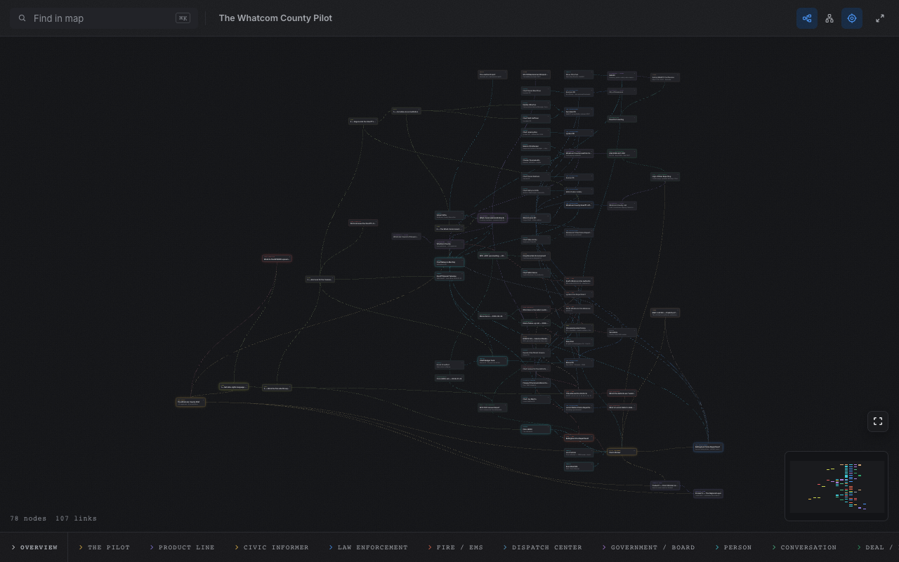
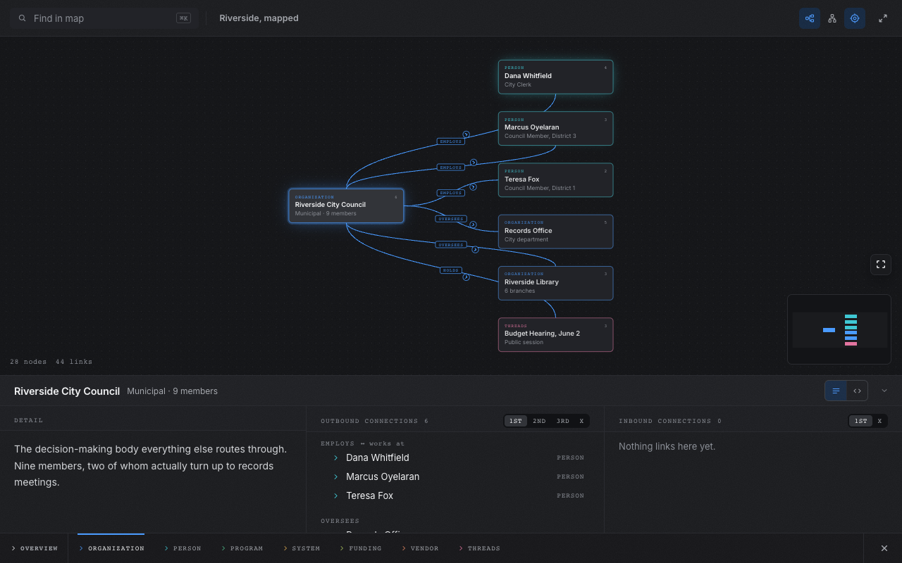

# md2hd for Obsidian

**Your vault, mapped.** Right-click a note or folder, pick **Open as md2hd
map**, and the structure you have been holding in your head becomes a tab you
can read — frontmatter becomes typed nodes, wikilinks and `rel:` entries
become labelled edges, and the map redraws itself as you edit.



## Why

Obsidian's graph view shows you that links exist. md2hd shows you what they
mean. Nodes carry types you invent — `org`, `person`, `claim`, `scene`,
whatever the vault is about — and every link is a named relationship drawn in
the right direction. The same canvas reads an org chart, a service map, an
investigation, or a plot outline without knowing anything about any of them.

- **The map is a read surface.** Obsidian's editor stays the write path.
  Save a note and the open map redraws — no refresh, no re-import.
- **Focus answers questions.** Click a node and the map re-forms around it:
  what points at it on the left, what it points at on the right, with degree
  dials — 1st / 2nd / 3rd / X — that walk each direction further out.
- **Every link speaks in the node's own voice.** The same relationship reads
  `employs` from the organisation and `works at` from the person.
- **Nothing leaves your vault.** The map renders inside Obsidian from the
  notes on disk. No server, no network, no account, no telemetry.



## Using it

Three ways in, all equivalent:

1. Right-click a note or folder → **Open as md2hd map**.
2. Command palette → **md2hd: Map the current folder**.
3. Command palette → **md2hd: Map the whole vault**.

The strip at the foot of the canvas holds the map's surfaces: the
**Overview**, a tab per **type**, and — when you click a card — the **node**
itself, detail beside connections. Search filters the whole map; drag to
arrange.

## The markdown

Every node is a frontmatter block; every `[[wikilink]]` or `rel:` entry is an
edge. One optional `type: map` block configures the whole thing.

```markdown
---
type: map
title: Partnerships
inverse:
  works_at: employs
---

---
id: riverside-council
type: org
title: Riverside City Council
weight: lead
rel:
  employs: [dana-whitfield]
---

The anchor relationship. Everything routes through [[dana-whitfield]].
```

Notes that were never written for md2hd usually read fine as-is: a `---` line
only opens a node when what follows looks like YAML, and malformed blocks
degrade to prose instead of errors. Full syntax:
[md2hd.com/reference](https://md2hd.com/reference) ·
[guides](https://md2hd.com/guides)

## The agent skill

Writing a map by hand is easy; having a coding agent write one that compiles
to the graph you meant is what the bundled skill is for. Run **md2hd: Install
skill** and the plugin writes
`writing-md2hd-maps` into your vault at `.agents/skills/` and
`.claude/skills/` — the two places agents look, whichever one you run. Open
the vault folder in your agent and "turn these notes into an md2hd map"
produces markdown that opens as the map you asked for.

## Install

Until the plugin lands in the community directory:

1. Download `manifest.json` and `main.js` from the
   [latest release](https://github.com/evan-steinhilb/md2hd-obsidian/releases/latest).
2. Put them in `<vault>/.obsidian/plugins/md2hd/`.
3. Enable **md2hd** in Settings → Community plugins.

Prefer the terminal? `npx md2hd notes/` opens the same maps in a browser —
that is the [md2hd CLI](https://github.com/evan-steinhilb/md2hd), no Obsidian
required.

## Build from source

```
npm install
npm test     # builds main.js, then smoke-checks it
```

The repo is standalone — `src/` carries the map renderer, synced out of the
md2hd monorepo by maintainers (`npm run sync`, which needs the monorepo
checkout around it).

## Release

Releases are built from version tags by GitHub Actions. Update the same stable
version in `package.json`, `manifest.json`, and `versions.json`, run `npm test`,
commit the regenerated `main.js`, then push the exact version tag (for example,
`0.2.4`, without a `v` prefix). The workflow rebuilds the committed bundle,
attests `main.js`, and publishes `main.js` with `manifest.json`.

After downloading an asset, its provenance can be checked with:

```sh
gh attestation verify main.js --repo evan-steinhilb/md2hd-obsidian
```

## License

[MIT](LICENSE)
